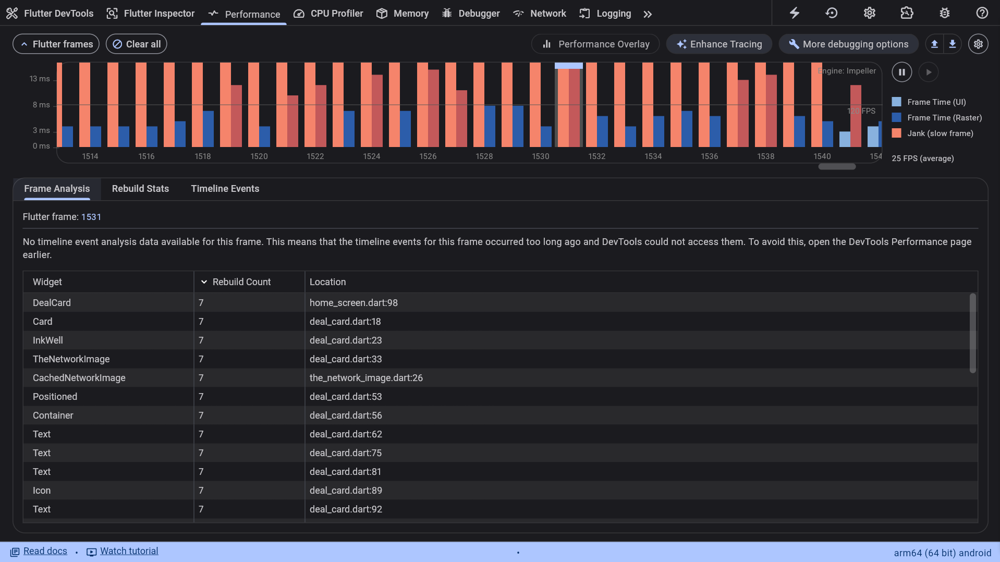
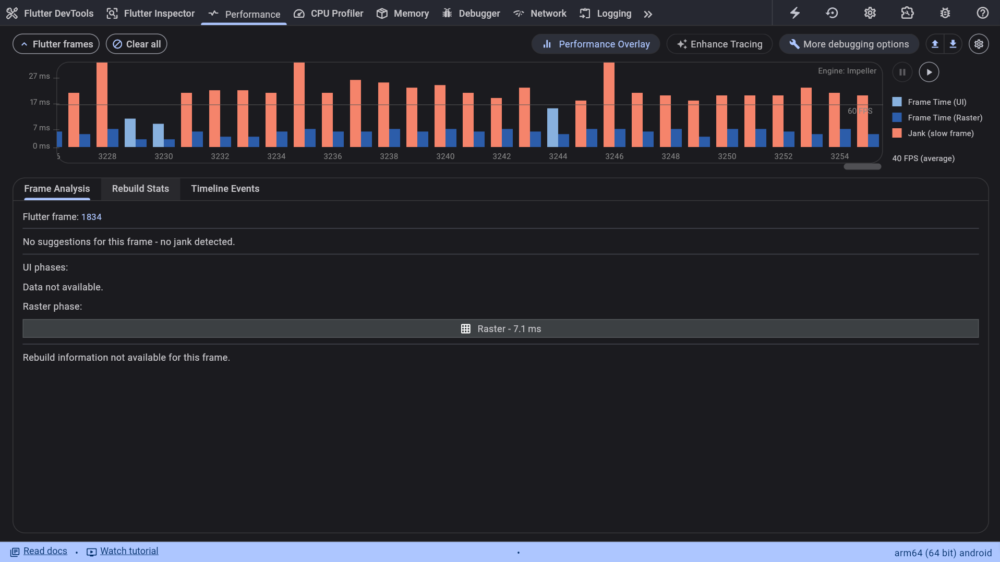
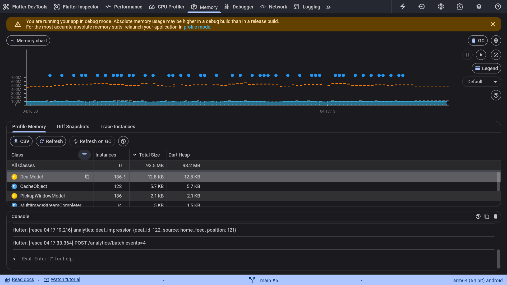
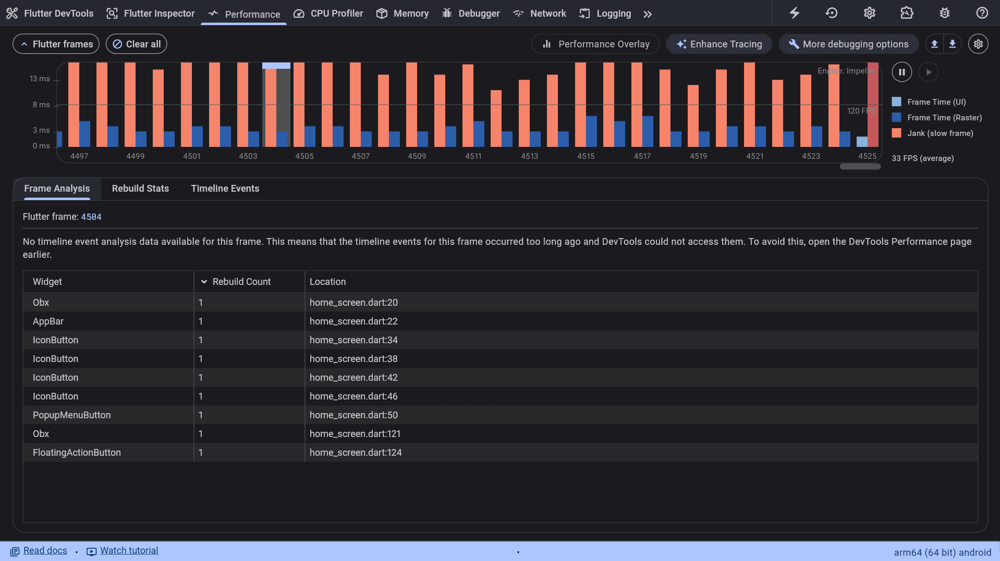
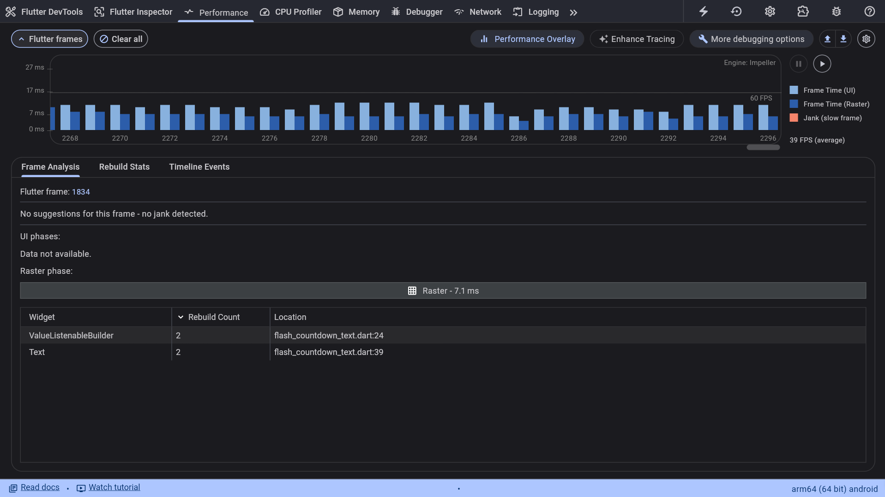
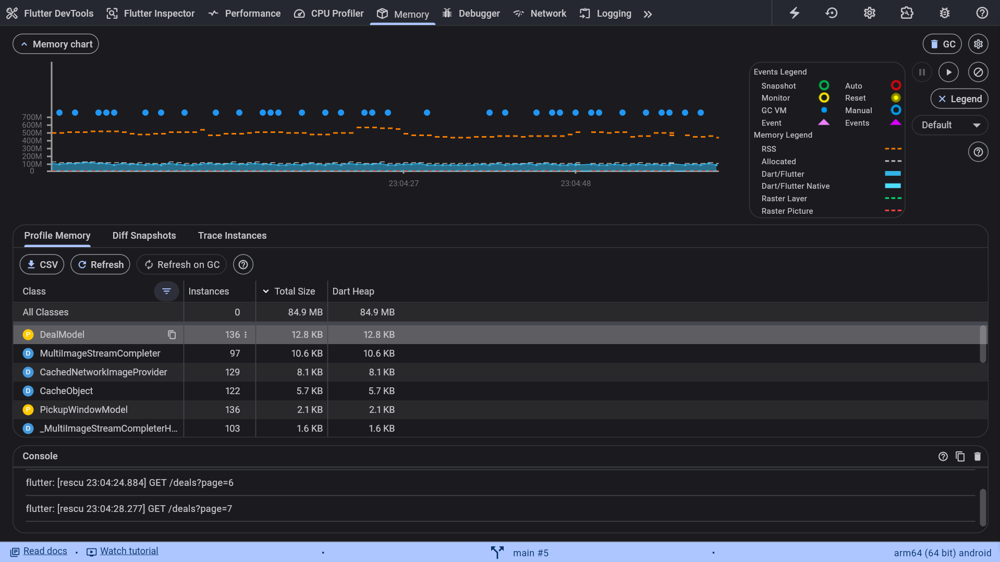

# solutions.md

## RES-101 Search shows results for the wrong query

**Root cause:** `_search()` fired on every keystroke with no delay and no way to cancel old requests. The API is intentionally slower for short broad queries like "s" (~1.2s) than specific ones like "sushi" (~0.2s). So typing "sushi" sends 5 requests "sushi" returns first and shows correct results, then "s" returns last and overwrites them.

**Why this fix is the right one:** Added a 300ms debounce time so only the final query is sent after the use pauses for a moment. Also added a generation counter so each search gets a ticket number, and when results come back we check if the number is still current. If a newer search starts, the stale results will be thrown away.

- _Alternative considered and rejected:_ My first thought after seeing the bug was using the debounce timer only. But when I discussed with the AI, I found that we really need both debounce and generation counter because if a user types and pauses (triggering a slow search), and then types again (triggering a fast search), the slow search could still arrive late and overwrite the correct results.

**Edge cases:** Clearing the text field resets immediately (no debounce). The debounce timer is cancelled in `onClose()` so it can't fire after the search screen is closed.

---

## RES-102 Crash after leaving My Orders

**Root cause:** In `pickup_countdown.dart`, a `Timer.periodic` is created in `initState()` to update the countdown every second. But the timer was never stored in a variable and there was no `dispose()` method. When the user navigates away, Flutter destroys the widget, but the orphaned timer keeps firing `setState()` on the dead widget causing the `setState() called after dispose()` crash.

**Why this fix is the right one:** Store the timer in a `_timer` variable and cancel it in `dispose()`. This is the standard Flutter pattern for cleaning up resources tied to a widget's lifecycle the timer only lives as long as the widget does.

- _Alternative considered and rejected:_ Wrapping `setState` in an `if (mounted)` check. This would stop the crash, but the timer would still run forever in the background wasting resources. The assessment says "a fix that merely hides the symptom scores worse than a correct diagnosis" so properly cancelling the timer is the right approach.

**Edge cases:** If the pickup window is already open when the widget loads (the remaining time is negative), the timer still ticks harmlessly showing "Pickup window is open", and gets properly cancelled when leaving. No additional logic needed.

---

## RES-103 Requests pile up the longer you browse

**Root cause:** In `deal_details_controller.dart`, this `ever(cartService.itemCount, ...)` use a listener to the global `CartService` every time we open a deal page. Because the global `CartService` lives forever but the controller is destroyed when we leave. The listener is glued to the permanent service, so it nevers get's cleaned up. Eg. after visiting 5 deals, there are 5 listeners and then tapping "Add to bag" results 5 separate API calls to re-check availability for all those deals.

**Why this fix is the right one:** Save the `Worker` object returned by `ever()` and call `_cartListener.dispose()` in the controller's `onClose()`. This way the listener dies when the controller dies, and only the current deal page reacts to cart changes.

- _Alternative considered and rejected:_ Removing the `ever()` entirely and just re-checking availability inside `addToCart()` after adding. This might work but breaks the reactive pattern like if someone else modifies the cart (e.g. from a different screen), this deal page wouldn't know about it.

**Edge cases:** If the user leaves the deal page before the re-check API call finishes, the response comes back to a disposed controller. But GetX handles this well, the observable update is ignored since nothing is listening anymore.

---

## RES-104 Duplicate deals in the home feed

**Root cause:** In `home_controller.dart`, there are `refreshDeals()` and `loadMore()` share the same `_page` variable without coordination. If the user pulls to refresh while the `loadMore()` is waiting for the server response, the refresh resets `_page` to 1. But `loadMore()` still finishes and appends its old page 2 data to list. The next scroll triggers `loadMore()` to fetch page 2 again (because `_page` is 1 now) results in duplicates.

**Why this fix is the right one:** We used a ticket like `_refreshGeneration` counter just like in RES-101. `refreshDeals()` increments the counter. `loadMore()` checks this counter before and after fetching data. If the counter changed while waiting, it means a refresh happened so the old data is rejected.

- _Alternative considered and rejected:_ Blocking pull-to-refresh while `loadMore()` is running. This would prevent the race condition but it is bad UX. Also if the network is slow, the user's natural reaction is to pull down to refresh, and blocking that makes the app feel broken.

**Edge cases:** If the user triggers multiple rapid refreshes, each one increments the generation, so only the very last refresh's data survives. The `finally` block ensures `_isFetchingMore` is always cleaned up even when we discard stale data.

---

## RES-105 Home feed jank

**Root cause:** There were three contributing problems in the home feed:

1. **Unnecessary rebuilds:** `scrollOffset` was observed by an `Obx` wrapping the entire `Scaffold`. The scroll listener updates `scrollOffset` continuously, so the whole screen subtree was rebuilt during scrolling even though only the AppBar elevation and FAB visibility needed the value.

2. **Eager list construction:** The feed used `ListView(children: ...)` and created all `DealCard` widgets from `visibleDeals` at once. As more deals were loaded, more widgets were created instead of building them only when needed.

3. **Large images in memory:** `TheNetworkImage` used `CachedNetworkImage` without `memCacheHeight` or `memCacheWidth`. The deal images are displayed at a fixed size, but the source images can be much larger, so the in-memory image cache could use more memory than necessary.

**Why this fix is the right one:**

1. **Targeted `Obx`:** Removed the top-level `Obx` and moved the `scrollOffset` observers to the AppBar and FAB. This prevents scroll updates from rebuilding the feed.

2. **Lazy list:** Replaced `ListView(children: ...)` with `ListView.builder`. Deal cards are now built lazily as they are needed.

3. **Image cache size:** Added `memCacheHeight` based on the displayed image height and device pixel ratio. This reduces the size of decoded images kept in the memory cache when the source image is much larger than the displayed image.

**DevTools Evidence:**

_Note: The screenshots for the evidence below are located in the `assets/` folder._

**Before the fixes:**

- **UI jank:** The UI thread reached 118.0 ms for a frame, well above the ~16 ms target for 60 FPS. `DealCard` was rebuilt over 1,500 times during the test.

- **Memory:** The Dart heap reached 114.2 MB. The memory profiler showed 305 `DealCard` instances during the test.

**After the fixes:**

- **UI performance:** UI thread time dropped from 118.0 ms to 4.8 ms during the comparable scrolling test, and the repeated feed rebuilds were no longer observed.

- **Raster performance:** Raster time was around 3.0 ms during steady scrolling.

- **Memory:** Dart heap usage dropped from 114.2 MB to 84.9 MB during the comparable test. The number of active `DealCard` instances was also substantially lower because the list is now built lazily.

- _*Alternative considered and rejected:*_ I considered using `CustomScrollView` with `SliverList`, but `ListView.builder` provides the required lazy construction with less structural change to the existing screen.

**Edge cases:** Pull-to-refresh continues to work as before. The AppBar remains correctly sized after moving its `Obx` into the `PreferredSize` wrapper.

---

## RES-106 Wrong pickup times; "Pickup today" filter misses deals

**Root cause:** The API sends pickup times as ISO-8601 strings in UTC format. `DateTime.parse()` reads this and creates a Dart `DateTime` object locked in the UTC timezone. Because it was never converted to local time, `DateFormat` blindly printed the raw UTC hours and also `isToday` check compared a UTC date against the user's local date. This causes deals filter display to mess up.

**Why this fix is the right one:** I added `.toLocal()` directly in the JSON parser (`PickupWindowModel.fromJson`). This instantly translates the UTC time into the user's local timezone exactly when the data enters the app. This is the cleanest fix because all downstream UI logic (like formatting and the filter check) now automatically operates on local time.

- _Alternative considered and rejected:_ We could kept the model in UTC and added `.toLocal()` only in the UI when formatting the string. I rejected this because it is error-prone: if another developer adds a new screen and forgets to add `.toLocal()`, the bug comes back.

**Edge cases:** I also hardened the `isToday` getter. Instead of just checking if `start.day == DateTime.now().day`, it now also checks the `year`, `month`, and `day`.

---

## AI Usage Log

**Tool used:** Antigravity IDE (Claude) for codebase analysis and understanding, root-cause identification, code fixes, and documentation.

**How I used it:** I had the AI analyze the entire codebase first to map out the architecture roughly, skim through the code and identify root causes for all bugs before writing any code. For each fix, I reviewed every line the AI generated and tested it myself. I commented out parts of the fix (eg. generation counter for search) to verify it was actually necessary by reproducing the bug without it.

**Example 1 wrong/misleading AI suggestion:**
_(To be filled with a real example as we `work through more bugs)_

**Example 2 wrong/misleading AI suggestion:**
_(To be filled with a real example as we work through more bugs)_

---

## Design Questions

**Q1:** _(To be answered)_

**Q2:** _(To be answered)_

**Q3:** _(To be answered)_

---

## Time Spent

| Phase               | Time  |
| ------------------- | ----- |
| Setup & environment | ~1 hr |
| Codebase analysis   | ~2 hr |
| Bug fixes           |       |
| Features            |       |
| Documentation       |       |
| **Total**           |       |

**What I'd do with one more day:** _(To be filled at the end)_
